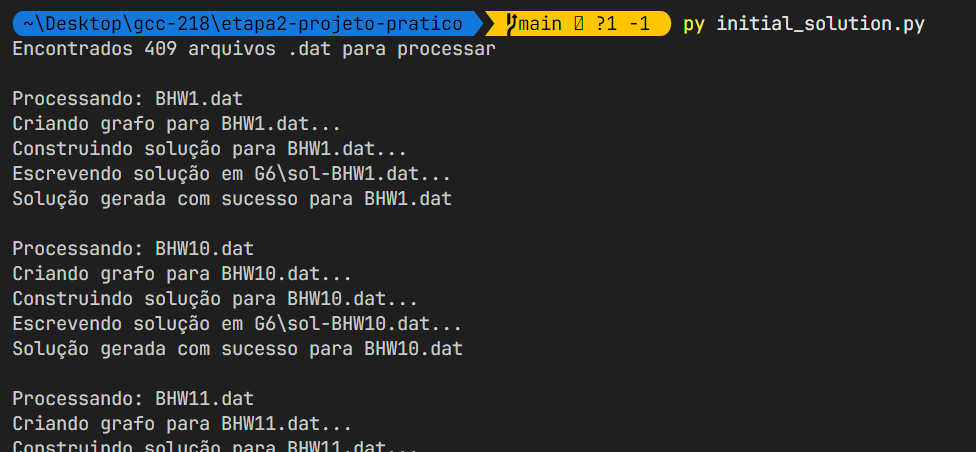

```bash
    AUTORES:
        Fábio Damas Valim (202410372)
        Guilherme Lirio Miranda (202410367)
```
# ETAPA 2 - Algoritmo Construtivo para o Problema de roteamento

## Atualizações da etapa 1

- ✅ **Atualização da visualização do grafo**: melhorias na geração de estatísticas e visualização dos dados foram feitas no notebook `my_statistics.ipynb`.
- ✅ **Entrada de dados via terminal**: a etapa 2 do projeto passou a permitir que o usuário selecione a instância e a capacidade via terminal ou por diretório completo com todas as instâncias.

---

## Descrição Geral

Este projeto implementa um algoritmo construtivo. O objetivo é gerar uma solução inicial viável, respeitando a capacidade dos veículos, atendendo todos os serviços obrigatórios definidos nos arquivos `.dat`.

O algoritmo realiza as seguintes tarefas principais:

1. **Leitura dos arquivos de instância** no diretório `MCGRP/`.
2. **Construção do grafo** com base nas estradas da instância.
3. **Identificação e separação dos serviços obrigatórios**, incluindo:
   - Nós com demanda (ReN)
   - Arestas com demanda (ReE)
   - Arcos com demanda (ReA)
4. **Construção de rotas** respeitando a capacidade do veículo.
5. **Cálculo do custo total e tempo de execução** (em clocks).
6. **Geração dos arquivos de saída** formatados no padrão esperado, armazenados no diretório `G6/`.

---

## 🗂️ Estrutura dos Arquivos

```bash
.
├── MCGRP/                # Pasta com instâncias do problema (.dat)
├── G6/                   # Pasta onde as soluções serão salvas
├── main.py               # Implementação da classe Graph
├── initial_solution.py   # Código principal para construir as soluções
├── my_statistics.ipynb   # Notebook com análise estatística e visualização
```

## 🧠 Lógica do Algoritmo
A classe initialSolution é responsável por construir uma solução inicial respeitando a capacidade do veículo. Os serviços são atendidos em ordem até atingir o limite de capacidade, e a rota retorna ao depósito.

Construção das rotas:
```python
    ...

    while remaining:
    route = []
    cost = 0
    demand = 0
    current = self.depot
    route.append("(D 0,1,1)")

    for item in remaining:
        if demand + item[1] <= self.capacity:
            # Verifica se o serviço pode ser atendido e adiciona à rota
            ...
    route.append("(D 0,1,1)")
    self.routes.append({...})

    ...
```

## Saída
Os arquivos de saída são salvos no diretório G6/, com o nome sol-<nome_da_instância>.dat. Cada arquivo contém:

- Custo total da solução
- Número de rotas
- Clocks totais da execução
- Clocks até a melhor solução
- Rotas detalhadas, no formato esperado pelo benchmark MCGRP

Exemplo de rota no arquivo de saída:

```scss
0 1 1 25 330 4 (D 0,1,1) (S 3,4,5) (S 5,7,9) (D 0,1,1)
```

## Execução

Para rodar o algoritmo em todas as instâncias do diretório `MCGRP/`, basta executar o script principal:

```bash
python initial_solution.py
```

<br>

- Durante a execução o programa (via terminal) nos mostra qual instância está sendo processada.


